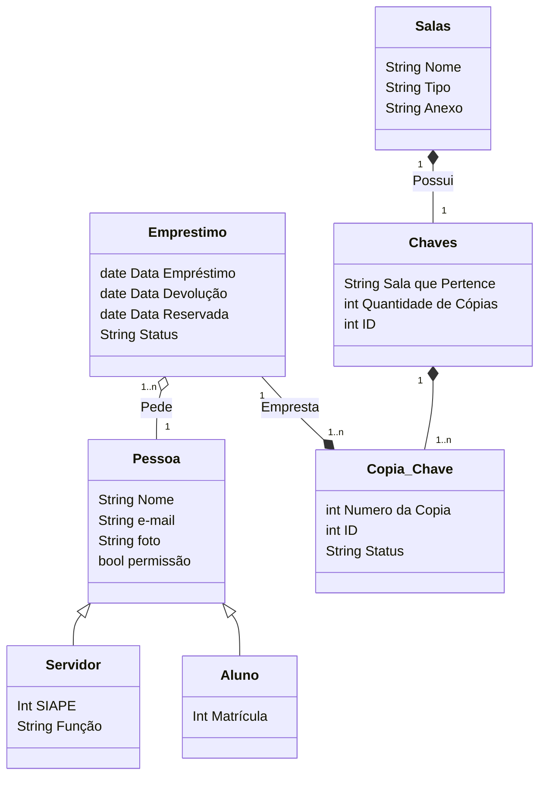

```mermaid

 classDiagram
    class Pessoa{
        String Nome
        String e-mail
        String foto
        bool permissão
    }
    class Servidor{
        Int SIAPE
        String Função
    }
    class Aluno{
        Int Matrícula
    }
    class Salas{
        String Nome
        String Tipo
        String Anexo
    }
    class Chaves{
        String Sala que Pertence
        int Quantidade de Cópias
        int ID
    }
    class Emprestimo{
        date Data Empréstimo
        date Data Devolução
        date Data Reservada
        String Status
    }
    class Copia_Chave{
        int Numero da Copia
        int ID
        String Status
    }

    Pessoa<|--Servidor
    Pessoa<|--Aluno

    Salas "1" *-- "1" Chaves : Possui
    Emprestimo "1..n" o-- "1" Pessoa: Pede
    Emprestimo "1" --* "1..n" Copia_Chave: Empresta
    Chaves "1" *-- "1..n" Copia_Chave

```
